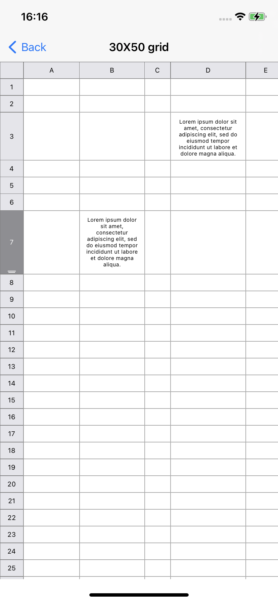

# GridCollectionView

This sample project showcases how to build a grid view with expandable rows and columns, with 'sticky' headers (like an MS Excel spreadsheet)

The implementation is based on a UICollectionView with custom UICollectionViewLayout.

